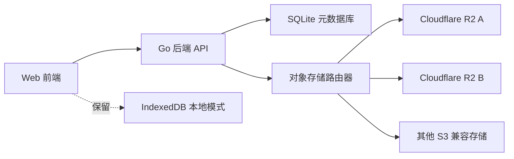

# SQLite + S3/R2 存储方案

## 目标

在保留现有浏览器本地 IndexedDB 存储的基础上，新增一套服务端存储模式：

- SQLite 保存画布、生成历史、工作流、分类、素材等元数据。
- S3 兼容对象存储保存图片和视频文件，优先支持 Cloudflare R2。
- 管理员后台可切换存储模式：本地 IndexedDB、服务端 SQLite + S3/R2、混合模式。
- 用户可配置自己的 S3 兼容存储，支持多个存储桶配置并轮询写入。

## 当前实现状态

当前代码已完成第一阶段可用版本：

- `storage_objects` 表保存已上传文件索引。
- 管理员 S3/R2 配置保存在 `settings.private.storage.providers`，暂未拆出独立 `storage_providers` 表。
- 用户自定义 S3/R2 配置保存在 `user_configs.storage_provider`，由前端配置弹窗手动同步到账号。
- 画布数据保存在 `user_configs.canvas_data` 快照，生图历史保存在 `user_configs.image_history` 快照，视频历史保存在 `user_configs.video_history` 快照。
- 工作流模板保存在 `creative_workflows` 表，支持个人/公开范围。
- 删除图片或已同步到对象存储的视频时会删除对象存储文件和 `storage_objects` 记录；素材或生成结果作为参考图使用时不会重复上传。

后续如果需要多人高并发、精细审计或增量同步，再按下方规划拆分更多业务表。

## 推荐架构



## 存储模式

`local_indexeddb`

当前方案。画布、历史和图片都在浏览器本地保存。成本最低，开发最少，但跨设备、备份、多人使用和服务器部署体验较弱。

`server_sqlite_s3`

推荐部署方案。前端只保存轻量缓存，核心数据写入后端。SQLite 记录业务元数据，对象存储保存大文件。适合个人服务器和小团队二开部署。

`hybrid`

本地先写 IndexedDB，后台异步同步到服务端。离线体验好，但同步冲突、失败重试和一致性处理更复杂，建议二期再做。

## SQLite 表设计

`storage_providers`

保存管理员或用户配置的 S3 兼容存储。

```sql
CREATE TABLE storage_providers (
  id TEXT PRIMARY KEY,
  owner_user_id TEXT,
  name TEXT NOT NULL,
  type TEXT NOT NULL DEFAULT 's3',
  endpoint TEXT NOT NULL,
  region TEXT,
  bucket TEXT NOT NULL,
  access_key_id TEXT NOT NULL,
  secret_access_key_encrypted TEXT NOT NULL,
  public_base_url TEXT,
  path_prefix TEXT NOT NULL DEFAULT '',
  weight INTEGER NOT NULL DEFAULT 1,
  enabled INTEGER NOT NULL DEFAULT 1,
  created_at INTEGER NOT NULL,
  updated_at INTEGER NOT NULL
);
```

`storage_objects`

保存文件对象索引，业务表只引用 `object_id`。

```sql
CREATE TABLE storage_objects (
  id TEXT PRIMARY KEY,
  provider_id TEXT NOT NULL,
  bucket TEXT NOT NULL,
  object_key TEXT NOT NULL,
  public_url TEXT,
  mime_type TEXT,
  bytes INTEGER NOT NULL DEFAULT 0,
  width INTEGER,
  height INTEGER,
  sha256 TEXT,
  created_by TEXT,
  created_at INTEGER NOT NULL,
  deleted_at INTEGER,
  UNIQUE(provider_id, object_key)
);
```

`canvases`、`canvas_nodes`、`canvas_connections`

画布元数据拆表保存，节点引用对象存储文件。

```sql
CREATE TABLE canvases (
  id TEXT PRIMARY KEY,
  user_id TEXT NOT NULL,
  title TEXT NOT NULL,
  viewport_json TEXT,
  theme_json TEXT,
  created_at INTEGER NOT NULL,
  updated_at INTEGER NOT NULL,
  deleted_at INTEGER
);

CREATE TABLE canvas_nodes (
  id TEXT PRIMARY KEY,
  canvas_id TEXT NOT NULL,
  type TEXT NOT NULL,
  title TEXT NOT NULL,
  position_json TEXT NOT NULL,
  size_json TEXT NOT NULL,
  metadata_json TEXT NOT NULL,
  object_id TEXT,
  created_at INTEGER NOT NULL,
  updated_at INTEGER NOT NULL
);

CREATE TABLE canvas_connections (
  id TEXT PRIMARY KEY,
  canvas_id TEXT NOT NULL,
  from_node_id TEXT NOT NULL,
  to_node_id TEXT NOT NULL,
  created_at INTEGER NOT NULL
);
```

`generation_logs`、`generation_images`

生成历史按任务保存，图片拆到子表。

```sql
CREATE TABLE generation_logs (
  id TEXT PRIMARY KEY,
  user_id TEXT NOT NULL,
  source TEXT NOT NULL DEFAULT 'image',
  prompt TEXT NOT NULL,
  model TEXT NOT NULL,
  config_json TEXT NOT NULL,
  reference_json TEXT NOT NULL DEFAULT '[]',
  workflow_id TEXT,
  workflow_name TEXT,
  workflow_inputs_json TEXT,
  duration_ms INTEGER NOT NULL DEFAULT 0,
  success_count INTEGER NOT NULL DEFAULT 0,
  fail_count INTEGER NOT NULL DEFAULT 0,
  errors_json TEXT NOT NULL DEFAULT '[]',
  created_at INTEGER NOT NULL
);

CREATE TABLE generation_images (
  id TEXT PRIMARY KEY,
  log_id TEXT NOT NULL,
  object_id TEXT,
  width INTEGER,
  height INTEGER,
  bytes INTEGER,
  mime_type TEXT,
  duration_ms INTEGER NOT NULL DEFAULT 0,
  sort_order INTEGER NOT NULL DEFAULT 0
);
```

`creative_workflows`

工作流模板仍以 JSON 保存变量和配置，便于快速演进。

```sql
CREATE TABLE creative_workflows (
  id TEXT PRIMARY KEY,
  user_id TEXT NOT NULL,
  name TEXT NOT NULL,
  category TEXT,
  description TEXT,
  variables_json TEXT NOT NULL,
  config_json TEXT NOT NULL,
  created_at INTEGER NOT NULL,
  updated_at INTEGER NOT NULL,
  last_run_at INTEGER
);
```

## 对象存储轮询策略

第一期建议用简单、可解释的加权轮询：

1. 查询当前用户可用的 `storage_providers`。
2. 过滤 `enabled = 1` 且连接健康的配置。
3. 按 `weight` 展开候选池并轮询写入。
4. 写入失败时切换下一个 provider，并记录失败次数。
5. 每个对象写入 `storage_objects`，业务数据只保存 `object_id`。

对象 Key 建议：

```text
{path_prefix}/{user_id}/{yyyy}/{mm}/{dd}/{object_id}.{ext}
```

## 后台配置

系统设置增加“数据存储”页签：

- 当前存储模式：IndexedDB / SQLite + S3 / 混合。
- 默认对象存储：系统默认 / 用户自定义。
- S3 配置列表：名称、Endpoint、Region、Bucket、公开域名、权重、启用状态。
- 测试连接：写入一个小对象，读取 HEAD，随后删除。
- 迁移工具：从 IndexedDB 导出 JSON/ZIP，再导入服务端。

用户设置增加“我的对象存储”：

- 是否允许用户自带 S3 配置由管理员控制。
- 用户配置只对自己的生成结果和画布资源生效。
- Secret 必须后端加密保存，前端不回显明文。

## API 设计

```text
GET    /api/storage/config
POST   /api/storage/providers
PATCH  /api/storage/providers/:id
DELETE /api/storage/providers/:id
POST   /api/storage/providers/:id/test

POST   /api/files/upload-url
POST   /api/files/commit
GET    /api/files/:id

GET    /api/generation-logs
POST   /api/generation-logs
PATCH  /api/generation-logs/:id
DELETE /api/generation-logs/:id

GET    /api/canvases
POST   /api/canvases
GET    /api/canvases/:id
PUT    /api/canvases/:id
DELETE /api/canvases/:id
```

上传可选两种方式：

- 后端中转上传：实现简单，适合小规模，但占用服务器带宽。
- 预签名直传：成本低、性能好，前端直传 R2/S3，后端只提交 metadata，推荐生产使用。

## 成本与难度

| 方案 | 成本 | 难度 | 优点 | 风险 |
| --- | --- | --- | --- | --- |
| IndexedDB | 最低 | 低 | 无服务器依赖，当前可用 | 换设备丢数据，图片容易受浏览器清理影响 |
| SQLite + 本地文件 | 低 | 中 | 服务器部署简单 | 图片占服务器磁盘，备份和扩容一般 |
| SQLite + R2/S3 | 低到中 | 中 | 图片可靠、便宜、可 CDN、迁移清晰 | 需要配置对象存储和签名上传 |
| PostgreSQL + S3 | 中 | 高 | 多用户和并发更强 | 对个人 1Panel 部署复杂度更高 |
| 混合同步 | 低到中 | 高 | 离线体验最好 | 冲突处理复杂，排错成本高 |

## 分期建议

第一期：

- 后端增加 SQLite 表和服务端生成历史 API。
- 增加系统级 R2/S3 配置和测试连接。
- 图片上传采用后端中转，先跑通完整链路。
- 前端保留 IndexedDB，后台可切换 `local_indexeddb` 与 `server_sqlite_s3`。

第二期：

- 增加用户自定义 S3 配置。
- 增加多 provider 加权轮询和健康检查。
- 图片改为预签名直传。
- 增加 IndexedDB 导入服务端迁移工具。

第三期：

- 增加混合模式、离线队列和同步冲突处理。
- 增加对象生命周期清理、缩略图、配额统计。
